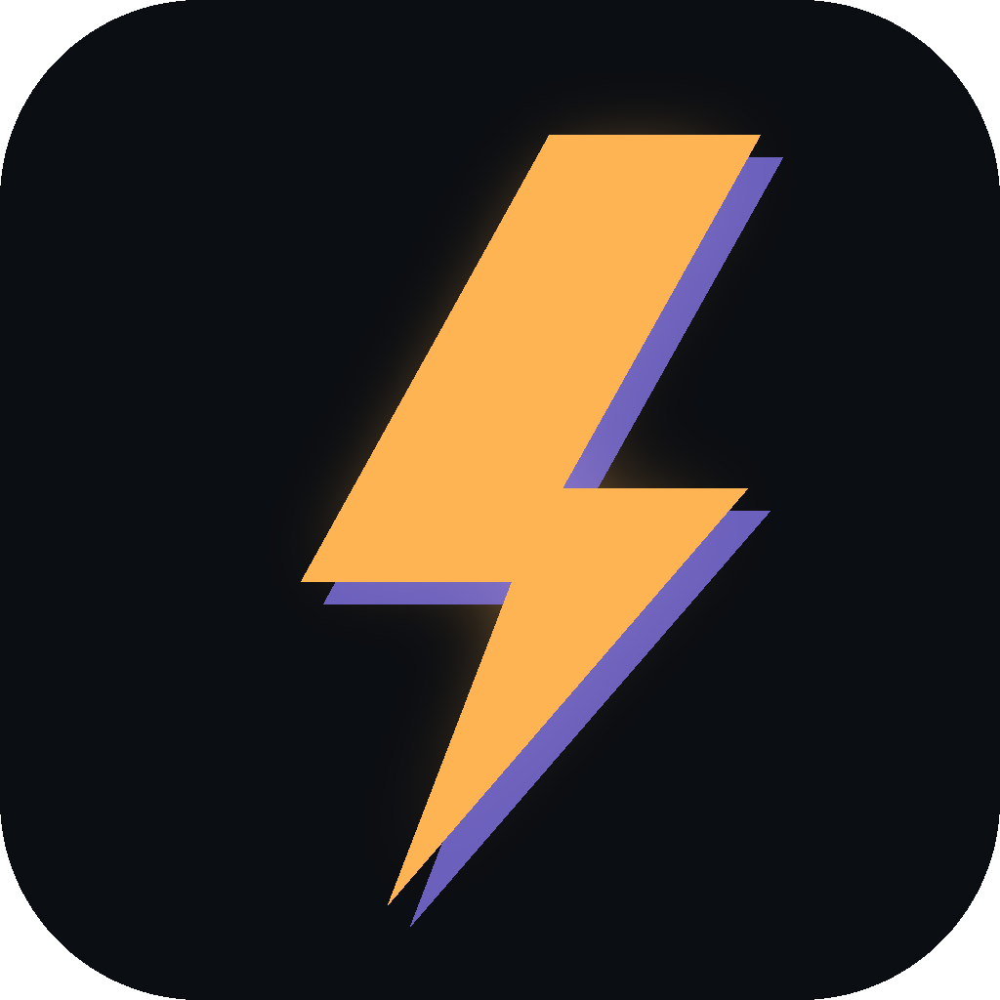
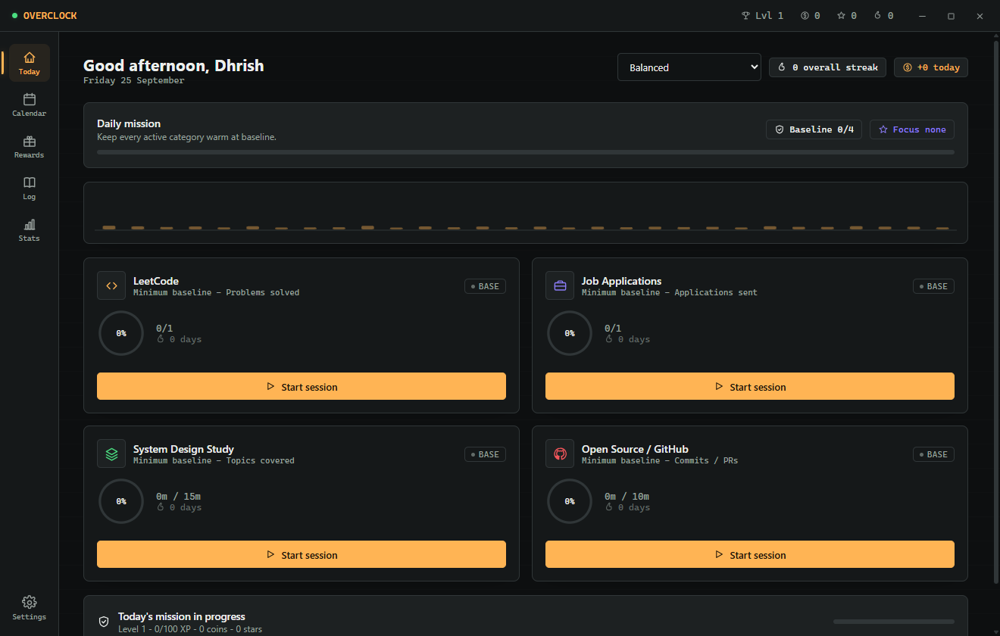
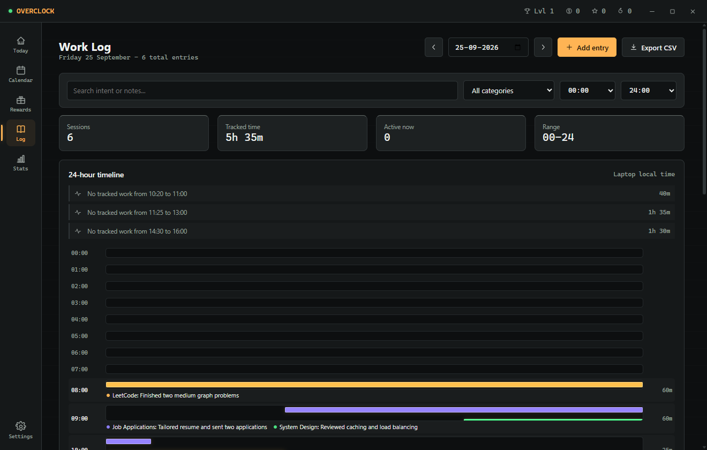
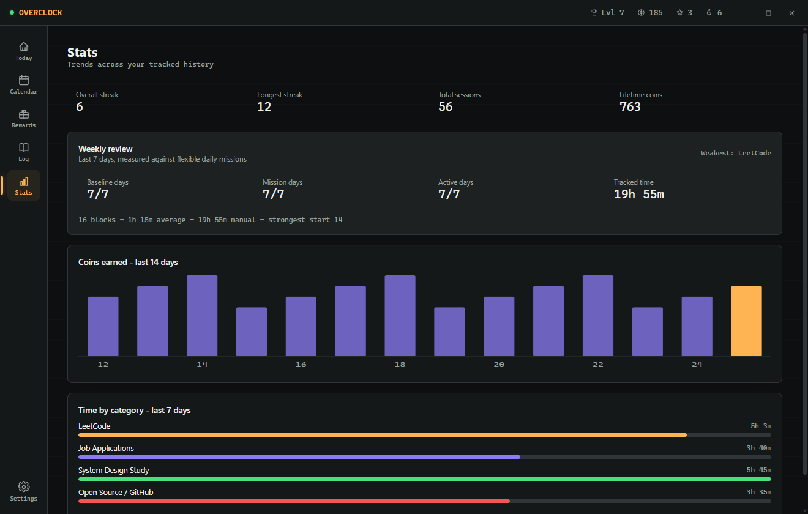
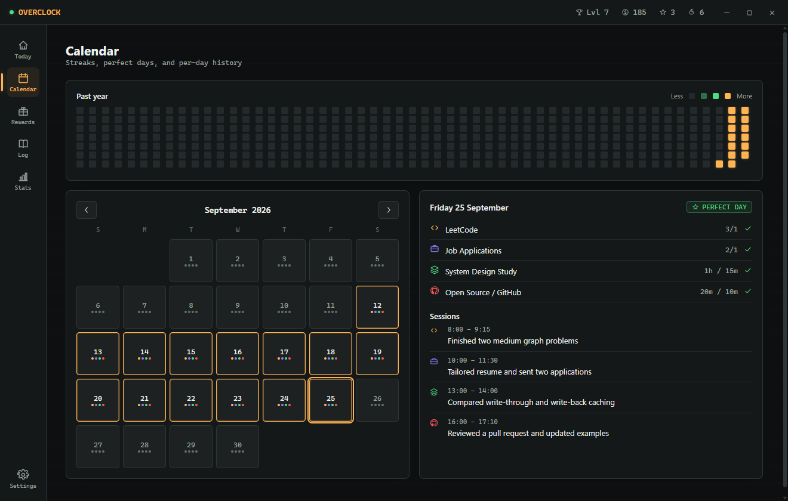
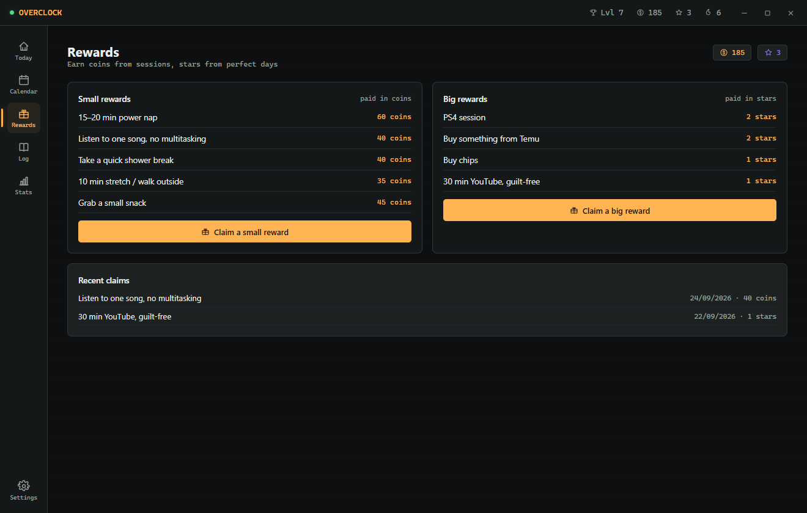

<div align="center">
  

  # Overclock

  **A private Windows focus tracker that turns a busy day into an honest timeline.**

  [](https://github.com/dhrish-s/OVERCLOCK/releases/latest)
  [](LICENSE)
  [](#install-overclock)
  [](#development)
</div>

Overclock is built for students, engineers, and anyone juggling focused work across a full day. Start a timer when you sit down, add forgotten work later, and use the worklog to see where your time actually went.

Everything stays on your computer. There is no account, cloud sync, subscription, analytics service, or telemetry.

<p align="center">
  
</p>

## Why Overclock

Most timers remember duration but lose context. Overclock keeps the task, category, time range, daily target, and outcome together. The result is a useful record rather than a pile of disconnected stopwatch totals.

| Plan the day | Track the work | Learn from it |
| --- | --- | --- |
| Choose balanced, focused, or recovery targets | Run one stopwatch, countdown, or Pomodoro session at a time | Review a 24-hour timeline and idle gaps |
| Set category goals that fit the day | Add one-off and forgotten work manually | Compare weekly activity and category totals |
| Keep minimum goals realistic | See the active task from every screen | Build streaks and spend earned rewards |

## A Closer Look

The gallery below uses synthetic sample activity created only for these screenshots. Click any image to see it at full size.

<table>
  <tr>
    <td width="50%" valign="top">
      <a href="docs/images/overclock-worklog.png"></a>
      <br><strong>Hourly worklog</strong><br>
      <sub>See finished tasks inside the day, along with the gaps between them.</sub>
    </td>
    <td width="50%" valign="top">
      <a href="docs/images/overclock-insights.png"></a>
      <br><strong>Weekly insights</strong><br>
      <sub>Compare active days, tracked time, earned coins, and category balance.</sub>
    </td>
  </tr>
  <tr>
    <td width="50%" valign="top">
      <a href="docs/images/overclock-calendar.png"></a>
      <br><strong>Calendar history</strong><br>
      <sub>Open any day to review its goals, work blocks, and perfect-day status.</sub>
    </td>
    <td width="50%" valign="top">
      <a href="docs/images/overclock-rewards.png"></a>
      <br><strong>Personal rewards</strong><br>
      <sub>Turn completed work into small breaks and bigger rewards you chose yourself.</sub>
    </td>
  </tr>
</table>

## Features

- **One active session:** Starting a timer locks the other task controls until the session ends.
- **Automatic worklog:** Timer sessions appear in the hourly timeline without duplicate entry.
- **Manual time entry:** Backfill a task with its category, date, start time, end time, and note.
- **Quick templates:** Add common activities such as Gym, Class, Reading, Interview prep, and Errands.
- **Editable history:** Correct or remove finished manual entries when plans change.
- **Idle gap detection:** See untracked periods between work blocks instead of guessing where the day went.
- **Flexible focus tools:** Use stopwatch, countdown, or Pomodoro modes for each category.
- **Daily modes:** Switch between baseline goals, focused targets, and recovery days.
- **Weekly insights:** Review time, sessions, completed work, and category patterns.
- **Motivation that stays optional:** Earn streaks, coins, stars, and personal rewards.
- **Restart recovery:** Restore interrupted sessions and protect local data with rotating backups.
- **Quiet background use:** Keep reminders running from the Windows tray without leaving the main window open.

## Install Overclock

### Download Version 1.0.1

1. Open the [latest GitHub release](https://github.com/dhrish-s/OVERCLOCK/releases/latest).
2. Download `Overclock.Setup.1.0.1.exe`.
3. Run the installer and choose an installation folder.
4. Launch Overclock from the Start menu or desktop shortcut.

The Version 1.0.1 installer is not code-signed. Windows SmartScreen may show an unrecognized publisher warning. If you downloaded it from this repository, select **More info**, then **Run anyway**.

### Run From Source

You need Windows 10 or 11, Git, and the current [Node.js LTS](https://nodejs.org/) release.

```powershell
git clone https://github.com/dhrish-s/OVERCLOCK.git
cd OVERCLOCK
npm install
npm start
```

`npm start` opens the app directly from the repository. It does not install anything into Windows.

## Everyday Flow

1. Pick a day mode that matches your available energy and priorities.
2. Start a category session with a concrete intention.
3. Finish the session and record the result.
4. Add offline or forgotten work through the manual entry form.
5. Read the hourly worklog to find productive blocks and empty gaps.
6. Check the weekly view for patterns worth keeping or changing.

Closing the window keeps Overclock in the system tray. Choose **Quit** from the tray menu when you want to stop it completely.

## Development

Install dependencies once:

```powershell
npm install
```

Then use the command that matches the job:

| Command | What it does |
| --- | --- |
| `npm start` | Run the Electron app from source |
| `npm run dev` | Run with the development flag enabled |
| `npm test` | Run logic and storage recovery tests |
| `npm run dist:dir` | Create an unpacked Windows build for quick testing |
| `npm run dist` | Create the Windows installer |

A healthy test run currently finishes with:

```text
115 passed, 0 failed
4 storage recovery checks passed
```

The unpacked app is written to `dist\win-unpacked\Overclock.exe`. The installer is written to `dist\Overclock Setup 1.0.1.exe`.

If PowerShell blocks `npm.ps1`, use the Windows command shim instead:

```powershell
npm.cmd test
npm.cmd run dist
```

## Local Data

Your activity data lives here:

```text
%APPDATA%\Overclock\overclock-data.json
```

Rotating recovery copies live in `%APPDATA%\Overclock\backups\`. You can also export or import a complete JSON backup from **Settings > Data**.

Reinstalling the app normally leaves this folder untouched. Exporting a backup before a major Windows change is still a sensible precaution.

## Project Structure

```text
main.js            Electron window, tray, reminders, and secure IPC
preload.js         Narrow bridge between Electron and the interface
storage.js         Local data recovery and backup loading
src/js/state.js    Application state and persistence flow
src/js/logic.js    Testable dates, goals, rewards, and worklog rules
src/js/views/      Dashboard, worklog, calendar, rewards, and settings
src/styles/        Layout, components, and animation styles
test/              Logic and storage recovery tests
```

The renderer runs with context isolation, sandboxing, and Node integration disabled. The app loads only bundled local files and does not make network requests.

## Contributing

Issues and focused pull requests are welcome. Before opening a pull request:

1. Keep the app local-first and lightweight.
2. Match the existing interface and state patterns.
3. Add tests for behavior that can be isolated from the UI.
4. Run `npm test` and package with `npm run dist:dir`.

## License

Overclock is open source under the [MIT License](LICENSE). You may use, modify, and distribute it under the terms in that file.

<div align="center">
  <sub>Built to make focused work visible without turning tracking into another job.</sub>
</div>
